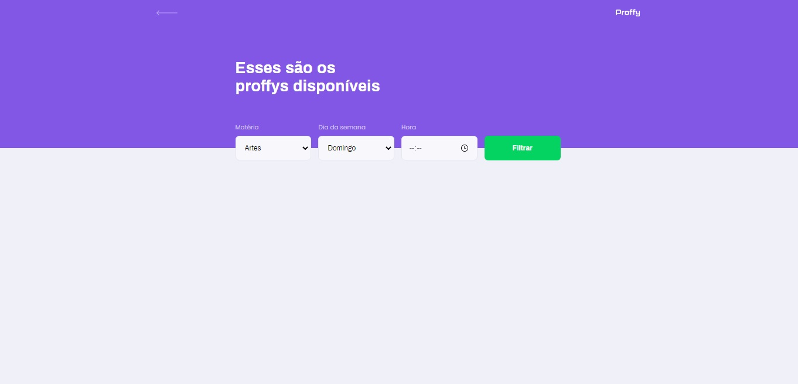

# Proffy
Este é um projeto desenvolvido durante a Next Level Week, realizada pela @Rocketseat durante os dias 3 a 9 de Agosto de 2020.

O Proffy visa conectar profissionais da educação para com possíveis novos alunos. Na plataforma você pode cadastrar-se como professor ou simplesmente listar todos os profissionais disponíveis com base em um sistema de filtros (dia da semana, horário e disciplina ministrada).

##  :camera: Preview

## :hammer: Instalação

    # Clonar o repositório
    git clone https://github.com/jdfloressilva/Proffy.git

    # Acesse o diretório
    cd proffy

    # Baixar e instalar as dependências
    npm install

    # Iniciar o servidor
    npm run dev

    # Acessar
    Abra seu navegador e acesse o endereço http://localhost:5000/

## :computer: Dependências de desenvolvimento

**Server**
- javascript
- sqlite3

**Web**
- HTML
- CSS
- SASS

## Contato
Para me localizar ou entrar em contato comigo: 
  

